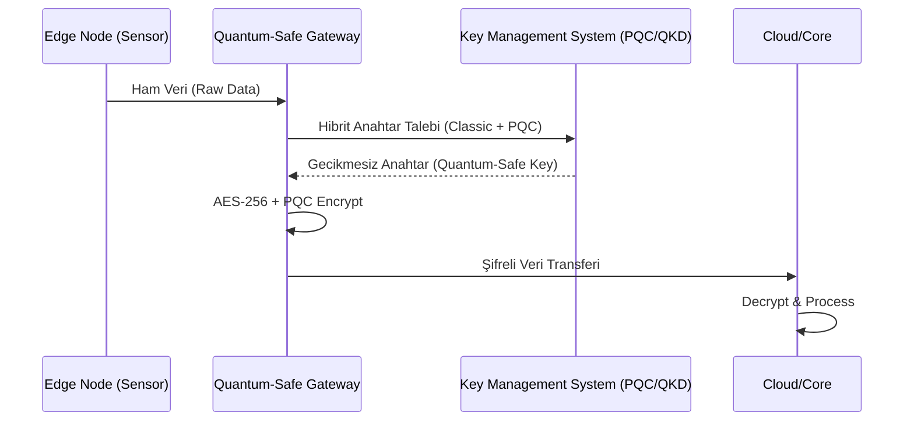

# 🏗️ Sistem Mimarisi: TRL-Quantum-Edge

Bu belge, kuantum-hazır uç bilişim ekosisteminin veri akışını ve katmanlı mimarisini detaylandırır.

## 📐 Genel Mimari Diyagramı

```mermaid
stackGraph
    title TRL-Quantum-Edge Stack Layers
    layer "Uygulama Katmanı" : "Akıllı Şehirler", "Otonom Araçlar", "Finansal Sistemler"
    layer "Kuantum Yazılım Katmanı" : "Simülatörler (Qiskit/Cirq)", "Kuantum Algoritmaları"
    layer "Güvenlik Katmanı (PQC)" : "Kyber/Dilithium Hibrit Modeller", "KMS"
    layer "Edge Katmanı (IŞ/IoT)" : "IoT Gateway (MQTT/gRPC)", "Uç Düğümler"
    layer "Fiziksel Donanım" : "ARMv8 CPUs", "FPGA Accelerators", "Quantum QBP (Gelecek)"
```

## 🔄 Veri Akışı (Quantum-Safe Orchestration)

Aşağıdaki diyagram, bir uç cihazın kuantum-güvenli anahtar değişimi ve veri iletim sürecini gösterir:



## 🛠️ Teknik Bileşenler

### 1. Unified TRL Engine
`src/main.py` içerisinde yer alan motor, aşağıdaki parametreleri kullanarak sistemin TRL skorunu dinamik olarak hesaplar:
- Algoritma Karmaşıklığı (Complexity)
- Donanım Uyumluluğu (Hardware Alignment)
- Güvenlik Direnci (Attack Resistance)

### 2. Quantum Isolation Layer
Uç cihazlarda çalışan ve kuantum simülasyonlarının "sandboxed" (yalıtılmış) bir ortamda çalışmasını sağlayan katman.

---

> [!IMPORTANT]
> Bu mimari, TRL 4 seviyesindeki laboratuvar testleri için optimize edilmiştir.
